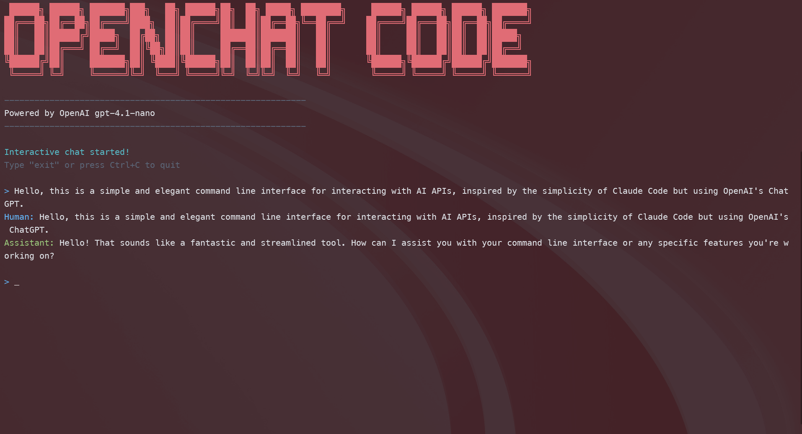

# OpenChat Code

A simple and elegant command-line interface to interact with AI APIs, inspired by the simplicity of Claude Code.

> **Note:** This project was developed 100% using Claude Code, demonstrating the power of AI-assisted development.

> **Disclaimer:** This project does not yet have all the features of Claude Code, but we are actively working on it! :)



## Features

- **Interactive Chat**: Continuous conversations with maintained context
- **Single Messages**: Direct command sending
- **Clean Interface**: Minimalist design focused on content
- **Elegant Banner**: Visual presentation with ASCII art
- **Intuitive Colors**: Clear differentiation between user and assistant

## Installation

1. Clone the repository:
   
   ```bash
   git clone <repository-url>
   cd openchat-code
   ```

2. Install dependencies:
   
   ```bash
   npm install
   ```

3. Configure your API key:
   
   ```bash
   cp .env.example .env
   # Edit the .env file and add your OPENAI_API_KEY
   ```

## Usage

### Interactive Chat

```bash
npm run dev chat
```

- Type your messages and receive responses with maintained context
- Type "sair" or press Ctrl+C to exit
- Console is automatically cleared on exit

### Single Message

```bash
npm run dev "Your message here"
```

### Development Commands

```bash
npm run build    # Compile TypeScript
npm run start    # Run compiled version
npm run dev      # Run in development mode
```

## Project Structure

```
openchat-code/
├── src/
│   ├── app/
│   │   └── index.ts          # Main application
│   ├── package.json          # Dependencies and scripts
│   ├── tsconfig.json         # TypeScript configuration
│   └── .env.example          # Configuration example
├── CLAUDE.md                 # Documentation for Claude Code
├── README.md                 # This file
└── LICENSE.md                # MIT License
```

## Technologies

- **TypeScript** - Main language
- **Node.js** - Runtime
- **OpenAI SDK** - API integration
- **Commander.js** - CLI interface
- **Chalk** - Terminal colors
- **Figlet** - ASCII banner
- **Readline-sync** - Interactive input

## Configuration

### Environment Variables

Create a `.env` file in the project root:

```env
OPENAI_API_KEY=your_openai_api_key_here
```

### Supported Models

The project is configured to use `gpt-4.1-nano`, but can be easily changed in the code.

## Design Philosophy

This project follows the principles of:

- **Simplicity**: Clean interface without unnecessary visual elements
- **Functionality**: Focus on real user needs
- **Reliability**: Proper handling of errors and interruptions
- **Extensibility**: Well-structured code for future improvements

## Future Features

Planned enhancements for upcoming versions:

- **File Management**: Read, write, and edit files directly from the chat
- **Code Analysis**: Search and analyze codebases with integrated tools
- **Multiple AI Providers**: Support for Claude, Gemini, and other AI models
- **Project Context**: Maintain project-wide context and memory
- **Plugin System**: Extensible architecture for custom tools and integrations
- **Git Integration**: Direct version control operations and repository management
- **Web Search**: Real-time information retrieval capabilities
- **Image Processing**: Support for image analysis and generation
- **Workflow Automation**: Multi-step task execution and scheduling
- **Configuration Profiles**: Multiple preset configurations for different use cases

## Contributing

1. Fork the project
2. Create a branch for your feature
3. Commit your changes
4. Push to the branch
5. Open a Pull Request

## License

This project is licensed under the MIT License - see the [LICENSE.md](LICENSE.md) file for details.

## Contact

For questions, suggestions, or issues, please open an issue in the repository.